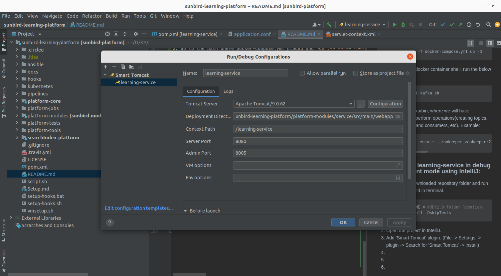
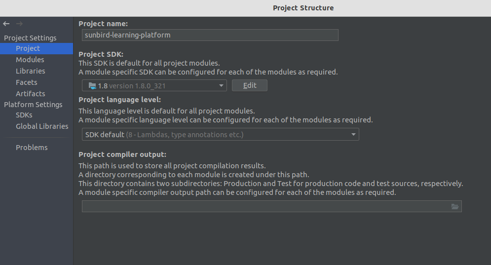
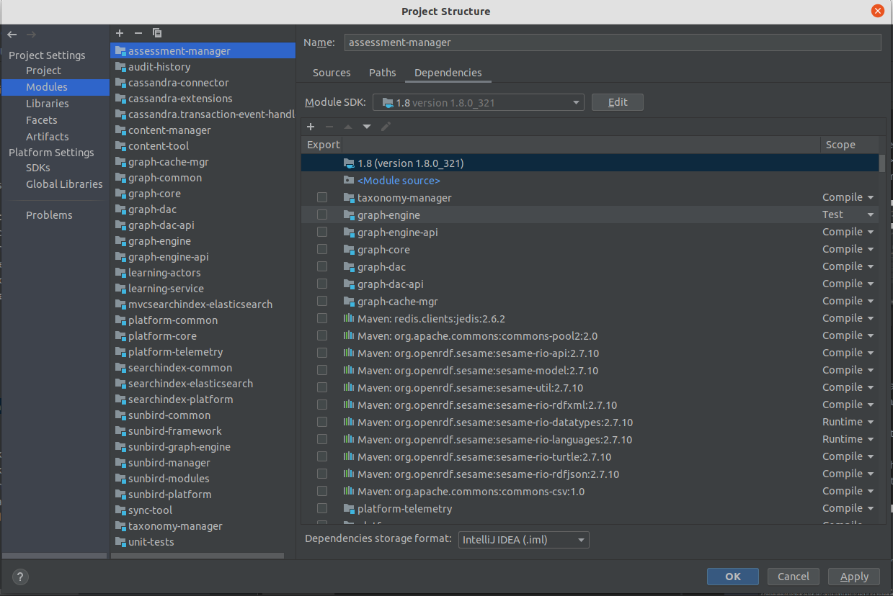
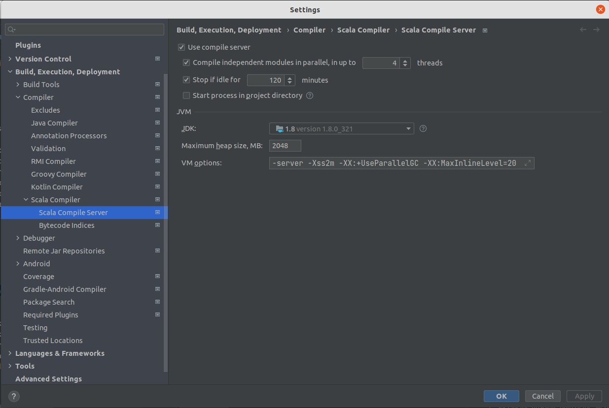

# Learning-Platform

 [](https://app.codacy.com/app/project-sunbird/sunbird-learning-platform?utm_source=github.com&utm_medium=referral&utm_content=project-sunbird/sunbird-learning-platform&utm_campaign=Badge_Grade_Dashboard)

The learning platform powers the ekStep pedagogy of Game Based Learning and Assessment. It captures the learning maps (taxonomy of concepts) and how these are delivered to the students as an adaptive learning experience. The platform keeps track of the child's progress, learning state and the proficiency gained as they learn while playing. 

The platform contains of the following projects:

* platform-core - Contains the core frameworks that drive the platform capabilities
* platform-modules - Functional/Pedagogy modules to support game based learning and API


## learning-service local setup
This readme file contains the instruction to set up and run the learnin-service in local machine.

### System Requirements:

### Prerequisites:
* Java 11 is required for docker container setups
* Java 8 and Tomcat v9 is required for local service setup via IntelliJ

### Prepare folders for database data and logs

```shell
mkdir -p ~/sunbird-dbs/neo4j ~/sunbird-dbs/cassandra ~/sunbird-dbs/redis ~/sunbird-dbs/es ~/sunbird-dbs/kafka
export sunbird_dbs_path=~/sunbird-dbs
```


### Elasticsearch database setup in docker:
```shell
docker run --name sunbird_es -d -p 9200:9200 -p 9300:9300 \
-v $sunbird_dbs_path/es/data:/usr/share/elasticsearch/data \
-v $sunbird_dbs_path/es/logs://usr/share/elasticsearch/logs \
-v $sunbird_dbs_path/es/backups:/opt/elasticsearch/backup \
 -e "discovery.type=single-node" docker.elastic.co/elasticsearch/elasticsearch:6.8.22

```
> --name -  Name your container (avoids generic id)
>
> -p - Specify container ports to expose
>
> Using the -p option with ports 7474 and 7687 allows us to expose and listen for traffic on both the HTTP and Bolt ports. Having the HTTP port means we can connect to our database with Neo4j Browser, and the Bolt port means efficient and type-safe communication requests between other layers and the database.
>
> -d - This detaches the container to run in the background, meaning we can access the container separately and see into all of its processes.
>
> -v - The next several lines start with the -v option. These lines define volumes we want to bind in our local directory structure so we can access certain files locally.
>
> --env - Set config as environment variables for Neo4j database
>


### Neo4j database setup in docker:
1. First, we need to get the neo4j image from docker hub using the following command.
```shell
docker pull neo4j:3.3.0 
```
2. We need to create the neo4j instance, By using the below command we can create the same and run in a container.
```shell
docker run --name sunbird_neo4j -p7474:7474 -p7687:7687 -d \
    -v $sunbird_dbs_path/neo4j/data:/var/lib/neo4j/data \
-v $sunbird_dbs_path/neo4j/logs:/var/lib/neo4j/logs \
-v $sunbird_dbs_path/neo4j/plugins:/var/lib/neo4j/plugins \
--env NEO4J_dbms_connector_https_advertised__address="localhost:7473" \
--env NEO4J_dbms_connector_http_advertised__address="localhost:7474" \
--env NEO4J_dbms_connector_bolt_advertised__address="localhost:7687" \
--env NEO4J_AUTH=none \
neo4j:3.3.0
```
> --name -  Name your container (avoids generic id)
>
> -p - Specify container ports to expose
>
> Using the -p option with ports 7474 and 7687 allows us to expose and listen for traffic on both the HTTP and Bolt ports. Having the HTTP port means we can connect to our database with Neo4j Browser, and the Bolt port means efficient and type-safe communication requests between other layers and the database.
>
> -d - This detaches the container to run in the background, meaning we can access the container separately and see into all of its processes.
>
> -v - The next several lines start with the -v option. These lines define volumes we want to bind in our local directory structure so we can access certain files locally.
>
> --env - Set config as environment variables for Neo4j database
>
> Using Docker on Windows will also need a couple of additional configurations because the default 0.0.0.0 address that is resolved with the above command does not translate to localhost in Windows. We need to add environment variables to our command above to set the advertised addresses.
>
> By default, Neo4j requires authentication and requires us to first login with neo4j/neo4j and set a new password. We will skip this password reset by initializing the authentication none when we create the Docker container using the --env NEO4J_AUTH=none.

3. Load seed data to neo4j using the instructions provided in the [link](master-data/loading-seed-data.md#loading-seed-data-to-neo4j-database)

4. Verify whether neo4j is running or not by accessing neo4j browser(http://localhost:7474/browser).

5. To SSH to neo4j docker container, run the below command.
```shell
docker exec -it sunbird_neo4j bash
```

### Redis database setup in docker:
1. we need to get the redis image from docker hub using the below command.
```shell
docker pull redis:6.0.8 
```
2. We need to create the redis instance, By using the below command we can create the same and run in a container.
```shell
docker run --name sunbird_redis -d -p 6379:6379 redis:6.0.8
```
3. To SSH to redis docker container, run the below command
```shell
docker exec -it sunbird_redis bash
```
### cassandra database setup in docker:
1. we need to get the cassandra image and can be done using the below command.
```shell
docker pull cassandra:3.11.8 
```
2. We need to create the cassandra instance, By using the below command we can create the same and run in a container.
```shell
docker run --name sunbird_cassandra -d -p 9042:9042 \
-v $sunbird_dbs_path/cassandra/data:/var/lib/cassandra \
-v $sunbird_dbs_path/cassandra/logs:/opt/cassandra/logs \
-v $sunbird_dbs_path/cassandra/backups:/mnt/backups \
--network bridge cassandra:3.11.8 
```
For network, we can use the existing network or create a new network using the following command and use it.
```shell
docker network create sunbird_db_network
```
3. To start cassandra cypher shell run the below command.
```shell
docker exec -it sunbird_cassandra cqlsh
```
4. To ssh to cassandra docker container, run the below command.
```shell
docker exec -it sunbird_cassandra /bin/bash
```
5. Load seed data to cassandra using the instructions provided in the [link](master-data/loading-seed-data.md#loading-seed-data-to-cassandra-database)


### Steps to start learning-service in debug or development mode using IntelliJ:
1. Navigate to downloaded repository folder and run below command in terminal.
```shell
export JAVA_HOME = #JDK1.8 folder location
mvn clean install -DskipTests
``` 
2. Open the project in IntelliJ.
3. Add 'Smart Tomcat' plugin. (File -> Settings -> plugin -> Search for 'Smart Tomcat' -> install)
4. Configure the tomcat server using 'Smart Tomcat' plugin under 'Add configuration'.

5. Give the 'name' as 'learning-service'. 
6. Specify the Tomcat v9 server location in 'Tomcat Server'. 
7. Specify the absolute path of the 'webapp' folder (under ../sunbird-learning-platform/platform-modules/service/src/main/webapp).
8. Mention '/learning-service' as the context path. Click on 'Apply'.
9. Click on 'File' -> 'Project Structure'. Check if Java version is set to jdk1.8 in both 'Project' and 'Modules'.


10. Click on 'File' -> Settings -> Build, Execution, Deployment -> compiler -> scala compiler -> scala compiler server. Check if Java version is set to jdk1.8.

11. Service configuration file is available at '../sunbird-learning-platform/platform-modules/service/src/main/resources/application.conf'. Update config file to connect to local databases.
12. Start Redis, neo4j, cassandra and ElasticSearch docker containers.
13. Start the 'learning-service' configuration in IntelliJ. Verify the health of learning service by trying to connect to 'http://localhost:8080/learning-service/health'.
